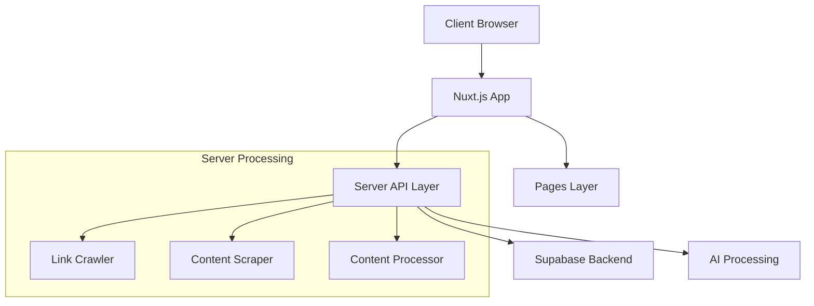

# System Patterns

## Architecture Overview



## Core Components

### Frontend Layer (Nuxt.js)
1. Pages
   - `/pages/index.vue`: Main article listing
   - `/pages/post/[id].vue`: Individual post view
   - `/pages/post/article/index.vue`: Article management

2. Layouts
   - `/layouts/default.vue`: Main application layout

### Server API Layer
1. Article Management
   - `/server/api/articles/index.ts`: Article listing
   - `/server/api/articles/[id].ts`: Single article operations
   - `/server/api/categories.ts`: Category management
   - `/server/api/tags.ts`: Tag management

2. Content Processing
   - `/server/api/crawl.ts`: Link crawling
   - `/server/api/scrap.ts`: Content scraping
   - `/server/api/link-process.ts`: Link processing
   - `/server/api/process-links.ts`: Bulk link processing

### Utility Layer
1. Core Utilities
   - `/server/utils/crawler.ts`: Link crawling logic
   - `/server/utils/scraper.ts`: Content scraping logic
   - `/server/utils/supabaseClient.ts`: Database client
   - `/server/utils/types.ts`: Type definitions

## Design Patterns

### Data Flow
1. Content Ingestion
   ```mermaid
   flowchart LR
       Crawler --> Scraper
       Scraper --> Processor
       Processor --> Storage[Supabase Storage]
   ```

2. Content Serving
   ```mermaid
   flowchart LR
       Request --> API
       API --> Supabase
       Supabase --> Response
   ```

### Future Integration Points

1. AI Processing Pipeline
   ```mermaid
   flowchart TD
       Article --> Summary[AI Summary]
       Article --> Format[HTML/CSS Enhancement]
       Article --> Title[Title Optimization]
       Article --> Social[Social Links]
   ```

2. Navigation System
   ```mermaid
   flowchart LR
       Posts --> Pagination
       Posts --> Categories
       Posts --> Tags
       Posts --> Related[Related Posts]
   ```

## Technical Decisions
1. Nuxt.js Framework
   - Server-side rendering capabilities
   - Built-in routing
   - TypeScript support
   - API route handling

2. Supabase Backend
   - PostgreSQL database
   - Real-time capabilities
   - Built-in authentication
   - Type generation

3. Server Processing
   - Dedicated crawler service
   - Separate scraper module
   - Link processing pipeline
   - Content optimization system
